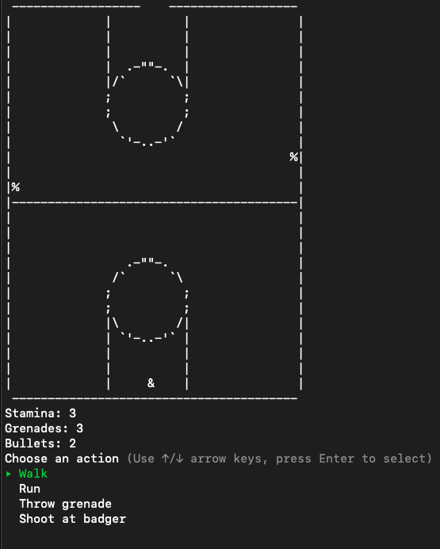
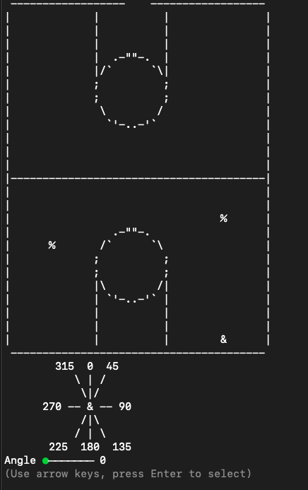
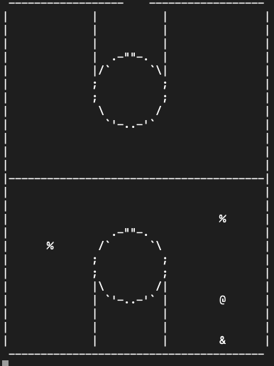
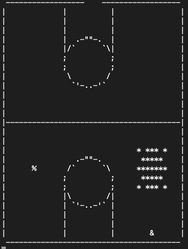

# Badgers And Gyms

CLI game created with Ruby, ActiveRecord, and TTY::Prompt

(Player -> `&` | Badgers -> `%`)



## Installing Badgers And Gyms

To install Badgers And Gyms, follow these steps:

1. Clone this repo:

```
git clone git@github.com:mpottebaum/badgers-and-gyms.git
```

2. Enter the directory and install gems:

```
cd badgers-and-gyms
bundle
```

## Using Badgers And Gyms

To use Badgers And Gyms, enter the following command into your terminal in the `badgers-and-gyms` directory:

```
ruby bin/run.rb
```

## How To Play

The badger apocalypse is upon you

You -> `&` | Badgers -> `%`

You can escape from the gym through the exit at the top
Or you can kill all of the badgers

Throw grenades to kill the badgers
Save your bullets for close-range combat

To throw a grenade, first select the direction of the throw
represented by degrees relative to your position and then select a power level from one to three

### Angle Menu



### Grenade Throw





## Contact

If you want to contact me you can reach me at mpottebaum@gmail.com.


